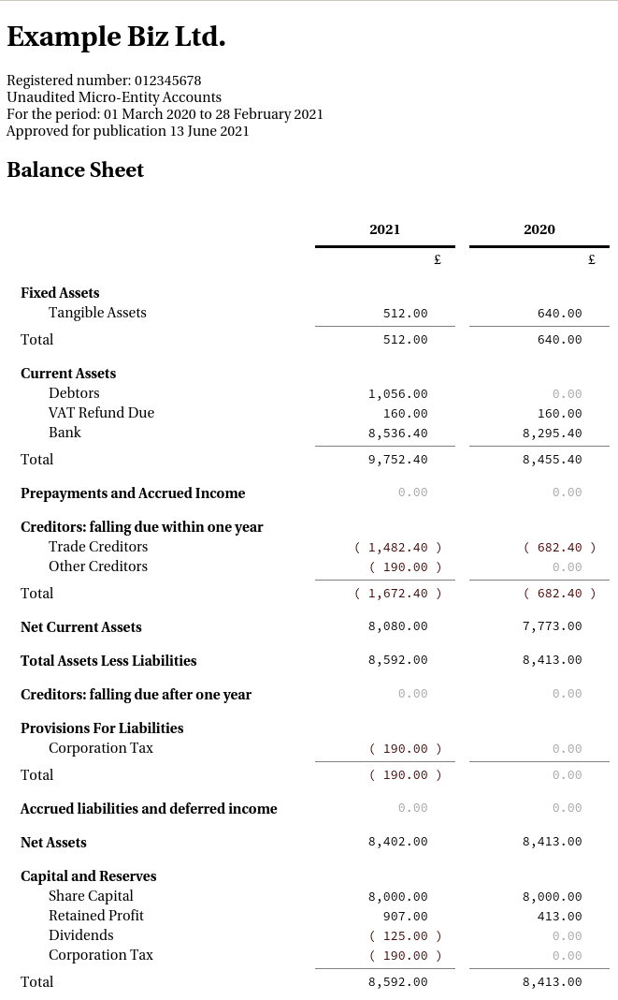

# Some sample output

## Plain text

```
Example Biz Ltd.
Registered number: 012345678
Unaudited Micro-Entity Accounts
For the period: 2020-03-01 - 2021-02-28
Approved for publication 2021-06-13

*** Balance Sheet ***
                                               2021       2020  

Fixed Assets:
  Tangible Assets                       :    512.00     640.00  
Total                                   :    512.00     640.00  

Current Assets:
  Debtors                               :   1056.00          -  
  VAT Refund Due                        :    160.00     160.00  
  Bank                                  :   8536.40    8295.40  
Total                                   :   9752.40    8455.40  

Prepayments and Accrued Income          :         -          -  

Creditors: falling due within one year:
  Trade Creditors                       :  (1482.40)   (682.40) 
  Other Creditors                       :   (190.00)         -  
Total                                   :  (1672.40)   (682.40) 

Net Current Assets                      :   8080.00    7773.00  

Total Assets Less Liabilities           :   8592.00    8413.00  

Creditors: falling due after one year   :         -          -  

Provisions For Liabilities:
  Corporation Tax                       :   (190.00)         -  
Total                                   :   (190.00)         -  

Accrued liabilities and deferred income :         -          -  

Net Assets                              :   8402.00    8413.00  

Capital and Reserves:
  Share Capital                         :   8000.00    8000.00  
  Retained Profit                       :    907.00     413.00  
  Dividends                             :   (125.00)         -  
  Corporation Tax                       :   (190.00)         -  
Total                                   :   8592.00    8413.00  

Total Capital and Reserves              :   8592.00    8413.00  


*** Income Statement ***
                                               2021       2020  

Turnover / revenue:
  Consultancy                           :   4000.00    3412.00  
Total                                   :   4000.00    3412.00  

Cost of Sales                           :  (2420.00)  (1927.00) 

Gross Profit                            :   1580.00    1485.00  

Administrative Expenses:
  Depreciation                          :   (128.00)   (160.00) 
  Other                                 :   (958.00)   (912.00) 
Total                                   :  (1086.00)  (1072.00) 

Profit (Loss)                           :    494.00     413.00  

```

## iXBRL output (in a browser)


